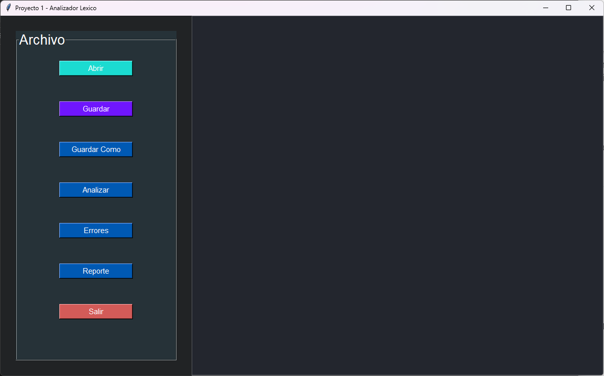
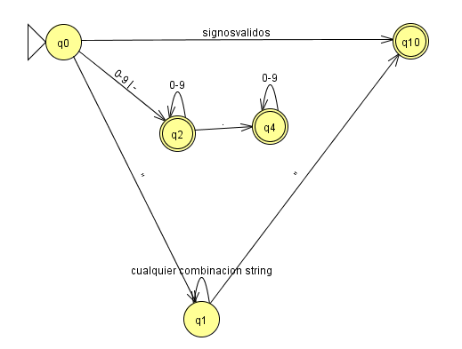

UNIVESIDAD DE SAN CARLOS DE GUATEMALA

FACULTAD DE INGENIERIA

ESCUELA DE CIENCAS Y SISTEMAS

LENGUAJES FORMALES Y DE PROGRAMACION

SECCIÓN A-

SEGUNDO SEMESTRE 2023

AUX. ENRIQUE ALEJANDRO PINULA QUIÑONEZ

Edgar Rolando Ramirez Lopez

201212891

Guatemala, septiembre del 2023


# <p align="center"> **MANUAL TECNICO** </p>

# Introduccion

El programa es una herramienta de análisis léxico desarrollada en Python con una interfaz gráfica de usuario implementada mediante la biblioteca Tkinter. Su principal función es cargar y analizar archivos de texto que contienen operaciones matemáticas, generando informes detallados de tokens y errores léxicos. Además, ofrece la capacidad de calcular y mostrar los resultados de estas operaciones. La aplicación se apoya en un autómata finito determinista (AFD) para reconocer los elementos léxicos del archivo de entrada. Este manual proporciona instrucciones sobre la instalación, ejecución y uso del programa, así como detalles de su implementación. Esta herramienta es útil para desarrolladores y estudiantes que deseen realizar análisis léxicos de archivos de texto de manera eficiente y comprender cómo funciona el proceso de análisis léxico en Python.

#	Contenido tecnico
El programa se compone de tres archivos principales:

1. main.py: Este archivo contiene la interfaz gráfica de usuario (GUI) desarrollada con Tkinter. La GUI permite cargar archivos de texto, realizar análisis léxicos, ver tokens, errores léxicos y resultados de operaciones.

2. analizador.py: Este archivo contiene la lógica del analizador léxico. El analizador recibe un texto como entrada y genera una lista de tokens y una lista de errores léxicos.

3. Token.py y error.py: Estos archivos definen las clases Token y Error, respectivamente, que se utilizan para representar los tokens y errores léxicos en el programa.

#   Requisitos del Sistema
El programa ha sido desarrollado y probado en Python 3. Se recomienda ejecutar el programa en un entorno que admita Python 3.

#   Instalación y Ejecución
1. Asegúrese de tener Python 3 instalado en su sistema.

2. Descargue los archivos main.py, analizador.py, Token.py y error.py en la misma carpeta.

3. Abra una terminal y navegue a la carpeta donde se encuentran los archivos descargados.

4. Ejecute el programa utilizando el siguiente comando:
```
python main.py
```

5. Se abrirá la interfaz gráfica de usuario, que le permitirá interactuar con el programa.


# Uso del Programa
## Interfaz Gráfica de Usuario
La interfaz gráfica de usuario consta de una ventana principal con varias opciones:

- Abrir: Permite cargar un archivo de texto en la aplicación.
- Guardar: Guarda el contenido actual en el archivo abierto.
- Guardar Como: Permite guardar el contenido actual en un nuevo archivo.
- Analizar: Realiza un análisis léxico del contenido del archivo cargado y muestra los tokens en el área de texto.
- Errores: Muestra los errores léxicos encontrados durante el análisis.
- Reporte: Genera un informe con los resultados de las operaciones matemáticas y muestra el resultado en el área de texto.
- Salir: Cierra la aplicación.




## Carga de Archivos
Al seleccionar la opción "Abrir", se abrirá un cuadro de diálogo que le permitirá seleccionar un archivo de texto (.txt) o un archivo JSON (.json). El contenido del archivo se mostrará en el área de texto de la aplicación.

## Análisis Léxico
Al seleccionar la opción "Analizar", el programa realizará un análisis léxico del contenido del archivo cargado y mostrará los tokens reconocidos en el área de texto. Los tokens se mostrarán con su nombre, lexema, fila y columna.

## Visualización de Errores
Al seleccionar la opción "Errores", el programa mostrará los errores léxicos encontrados durante el análisis. Los errores se mostrarán con el lexema, tipo, fila y columna.

## Generación de Reportes
Al seleccionar la opción "Reporte", el programa generará un informe con los resultados de las operaciones matemáticas encontradas en el archivo. Los resultados se mostrarán en el área de texto y una grafica realizada por medio de graphviz.

## Guardar y Guardar Como
Las opciones "Guardar" y "Guardar Como" permiten guardar el contenido actual en el archivo abierto o en un nuevo archivo, respectivamente.


## AFD del analizar lexico



# Detalles de Implementación
El programa utiliza la biblioteca Tkinter para crear la interfaz gráfica de usuario. La lógica del analizador léxico se encuentra en el archivo `analizador.py`. Los tokens y errores léxicos se representan mediante las clases `Token` y `Error` en los archivos `Token.py` y `error.py`.

La aplicación realiza el análisis léxico utilizando un autómata finito determinista (AFD) para reconocer tokens. Se pueden reconocer enteros, números decimales, cadenas delimitadas por comillas dobles y varios símbolos especiales.

## Conclusiones
Este manual técnico proporciona información detallada sobre el programa desarrollado en Python utilizando Tkinter para crear una interfaz gráfica de usuario. El programa permite cargar, analizar y trabajar con archivos de texto que contienen operaciones matemáticas, además de generar informes de tokens y errores léxicos.

El análisis léxico se basa en un autómata finito determinista (AFD) que reconoce tokens y errores léxicos en el texto de entrada.
