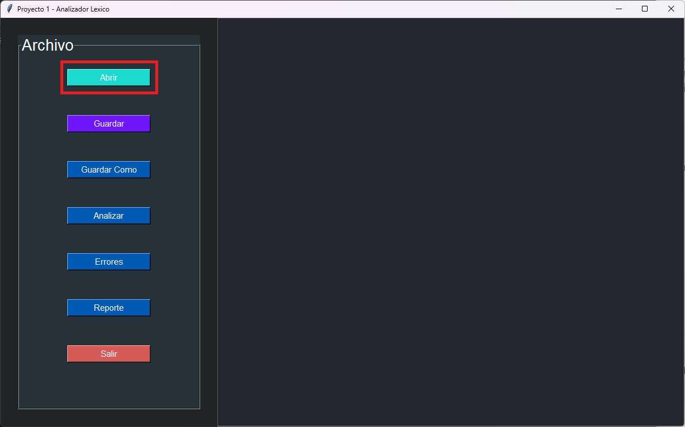
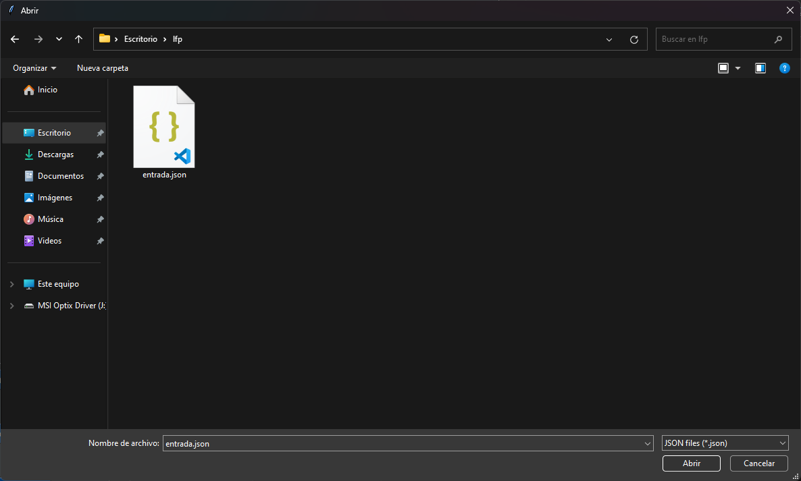
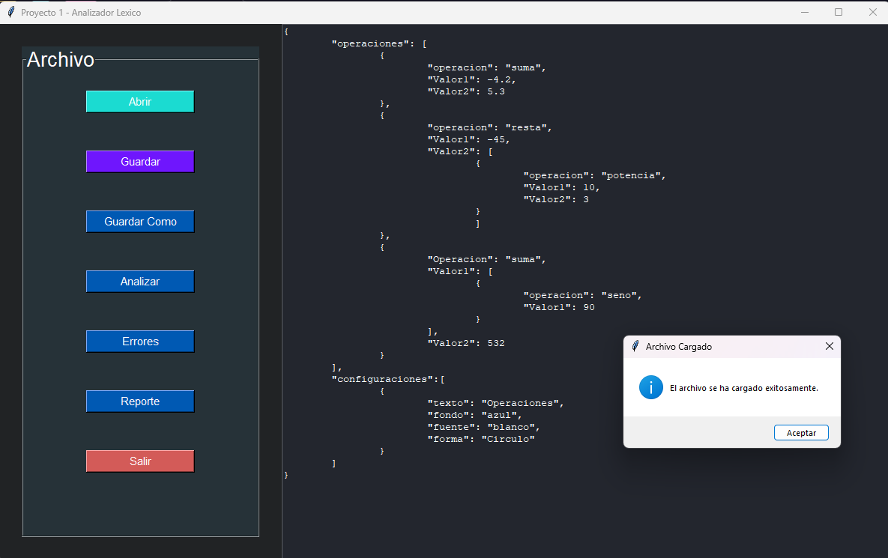
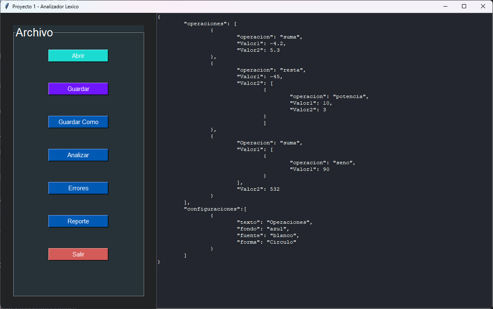
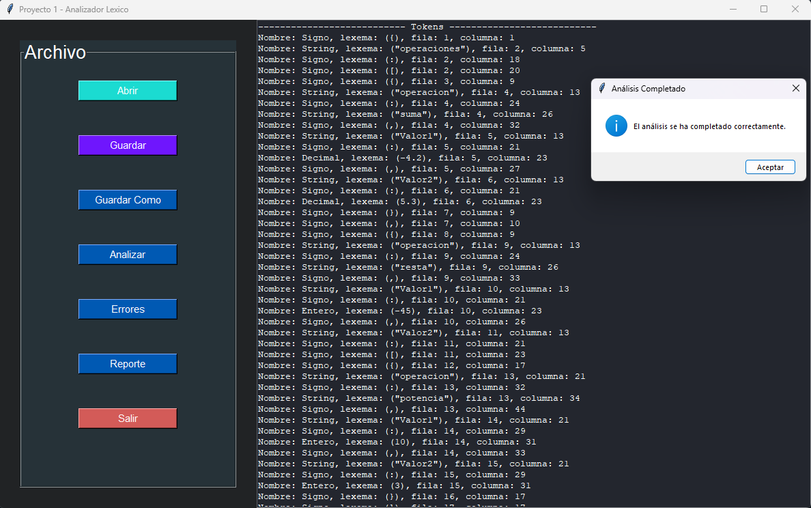
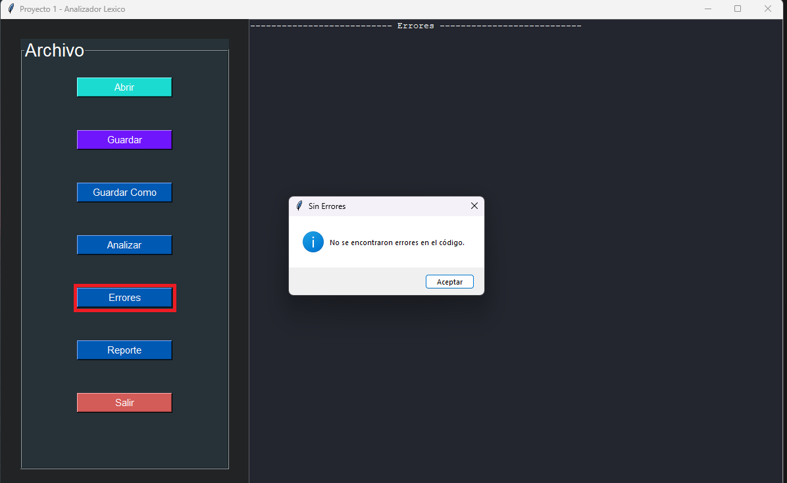
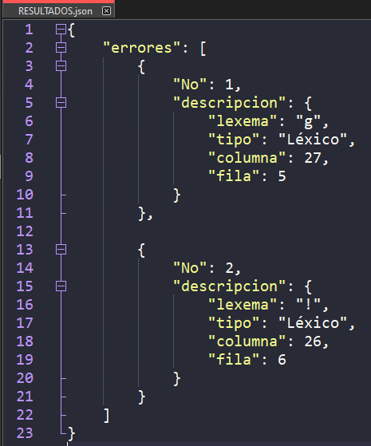
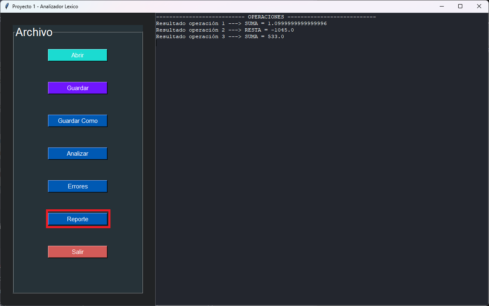

UNIVESIDAD DE SAN CARLOS DE GUATEMALA

FACULTAD DE INGENIERIA

ESCUELA DE CIENCAS Y SISTEMAS

LANGUAJES FORMALES Y DE PROGRAMACION

SECCIÓN A-

SEGUNDO SEMESTRE 2023

AUX. ENRIQUE ALEJANDRO PINULA QUIÑONEZ

Edgar Rolando Ramirez Lopez

201212891

Guatemala, septiembre del 2023

# 
 MANUAL DE USUARIO 

Este manual de usuario proporciona instrucciones detalladas sobre cómo utilizar el programa desarrollado en Python con interfaz gráfica de usuario (GUI) utilizando la biblioteca Tkinter. El programa está diseñado para cargar, analizar y trabajar con archivos de texto que contienen operaciones matemáticas, además de generar informes de tokens y errores léxicos.

## INTRODUCCION

El programa desarrollado en Python con una interfaz gráfica de usuario (GUI) utilizando la biblioteca Tkinter ofrece una solución eficiente para cargar, analizar y trabajar con archivos json que contienen operaciones matemáticas. Esta aplicación permite a los usuarios cargar archivos json, realizar análisis léxicos para identificar tokens y errores léxicos, y generar informes detallados de las operaciones matemáticas contenidas en los archivos. La interfaz de usuario intuitiva y amigable facilita la interacción, permitiendo a los usuarios realizar estas tareas de manera rápida y sencilla. Además, el programa ofrece la capacidad de guardar los resultados y proporciona una forma conveniente de administrar archivos. Esta herramienta es útil tanto para estudiantes como para profesionales que necesitan analizar y procesar archivos de texto que contienen expresiones matemáticas, brindando una solución eficaz para la gestión de datos y el análisis léxico en este contexto.

## Interfaz de Usuario
La interfaz de usuario proporciona una forma fácil de cargar archivos de texto, realizar análisis léxicos, ver tokens, errores léxicos y resultados de operaciones. A continuación, se describen las principales funcionalidades de la interfaz.

## Carga de Archivos
- Haga clic en el botón "Abrir".

- Se abrirá un cuadro de diálogo para seleccionar un archivo un archivo JSON (.json).

- Seleccione el archivo que desea cargar y haga clic en "Abrir".

## Realizar Análisis Léxico
1. Después de cargar un archivo, haga clic en el botón "Analizar".

2. El programa realizará un análisis léxico del contenido del archivo y mostrará los tokens reconocidos en el área de texto.

## Visualizar Errores Léxicos
1. Haga clic en el botón "Errores".
2. El programa mostrará cualquier error léxico encontrado durante el análisis en el área de texto.
3. Si no hay error se mostrara una ventana indicando que no hay.

4. Si hay errores creara un archivo json llamado RESULTADOS.json con los errores y tambien se mostrara en el cuadro de texto.

## Generar Informe de Operaciones
1. Haga clic en el botón "Reporte".
2. El programa generará un informe con los resultados de las operaciones matemáticas encontradas en el archivo y mostrará el informe en el área de texto.

## Guardar o Guardar Como
- Utilice las opciones "Guardar" o "Guardar Como" para guardar el contenido actual en el archivo abierto o en un nuevo archivo, respectivamente.

## Salir del Programa
- Haga clic en el botón "Salir" para cerrar la aplicación.

## Conclusiones
Este manual de usuario proporciona instrucciones detalladas sobre cómo utilizar el programa desarrollado en Python con interfaz gráfica de usuario (GUI) utilizando la biblioteca Tkinter. El programa permite cargar, analizar y trabajar con archivos de texto que contienen operaciones matemáticas, además de generar informes de tokens y errores léxicos.

La interfaz gráfica de usuario facilita la interacción con el programa y ofrece una forma conveniente de realizar análisis léxicos y obtener informes de resultados.